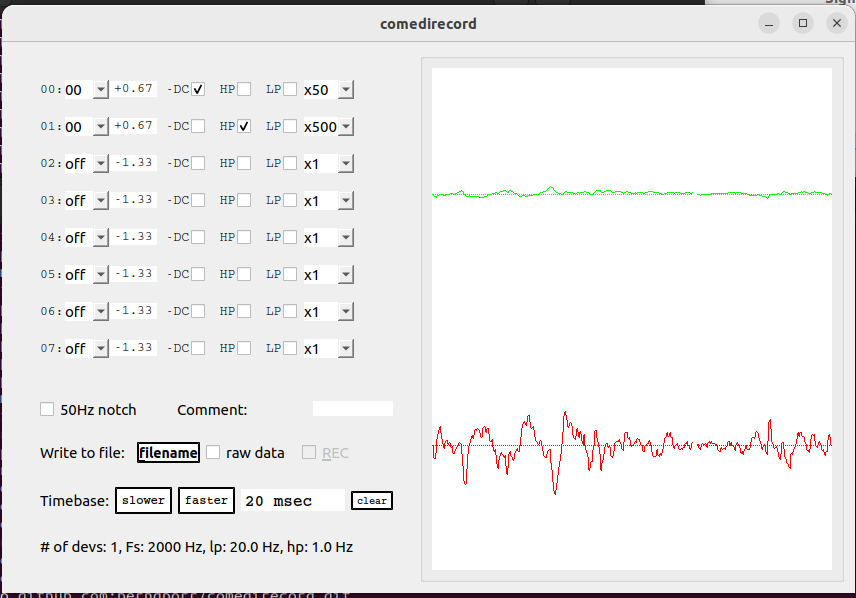

# comedirecord

An oscilloscope program for COMEDI



comedirecord is a simple program to record data from a
comedi device and write the data to a file. Its
philosophy is not to alter the data which is written
to the hard drive but allowing flexible monitoring
of the data, for example during an experiment. Data
is always saved at the maximum sampling rate (default
1kHz but can be changed with the "-r" parameter) 
and unfiltered in a Python-friendly format.

It has been designed for the [USB-DUX sigma
board](https://github.com/glasgowneuro/usbdux) but it should also run
with other daq boards supported by comedi. The number of channels is
set to the maximum number possible but can be changed by the
commandline parameter -c to increase the overall sampling rate.

A IIR notch filter has been implemented to filter out
unwanted hum from the mains. This might be useful for 
medical applications. Default is 50Hz but can be changed
via command line parameter -n.

The data is written out as an ASCII file and is always
unfiltered and at the max internal sampling rate.

Additional data from another program can be appended to the
data file via a socket connection. comedirecord acts as the 
server and the other application is its client. The port number
can be specified with the -p option and then comedirecord
waits until a client connects to it. You can test it
with: "comedirecord -p 65000" and then
"telnet localhost 65000".

The data can be imported into GNUPLOT, python or octave. 
The first column is the sample number or time in secs. 
The next columns represent the (raw/phys) data 
from the comedi device.


## Prerequisites

https://github.com/berndporr/iir1

Install the required packackes:
```
sudo apt install libqwt-qt5-dev libfftw3-dev libcomedi-dev qtbase5-dev
```

## Compilation

```
cmake .
make
```

Test it locally if it runs with:

```
./comedirecord
```

## Installation

```
sudo make install
```

which installs it in `/usr/local/bin`.


## Running it

After the global install type into the terminal:

```
comedirecord
```
